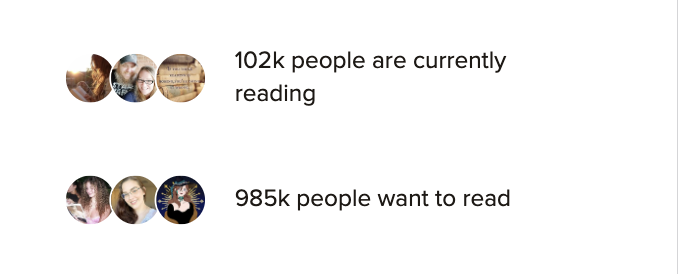

# Procesverslag

Markdown is een simpele manier om HTML te schrijven.  
Markdown cheat cheet: [Hulp bij het schrijven van Markdown](https://github.com/adam-p/markdown-here/wiki/Markdown-Cheatsheet).

Nb. De standaardstructuur en de spartaanse opmaak van de README.md zijn helemaal prima. Het gaat om de inhoud van je procesverslag. Besteedt de tijd voor pracht en praal aan je website.

Nb. Door _open_ toe te voegen aan een _details_ element kun je deze standaard open zetten. Fijn om dat steeds voor de relevante stuk(ken) te doen.

## Jij

  
uitwerken voor kick-off werkgroep

### Auteur:

Lisa Cornelis

#### Je startniveau:

(heel erg) blauw

#### Je focus:

responsive

## Je website

  
uitwerken voor kick-off werkgroep

### Je opdracht:

Ik ga de site Goodreads namaken:
https://www.goodreads.com/

#### Screenshot(s) van de eerste pagina (small screen):

Homepage Goodreads
 

#### Screenshot(s) van de tweede pagina (small screen):

Detailpagina  
 

## Toegankelijkheidstest 1/2 (week 1)

  
uitwerken na test in 2e werkgroep

### Bevindingen

Lijst met je bevindingen die in de test naar voren kwamen:

- De site had erg veel errors.
- De site liet te veel klikbare onderdelen zien en deze onderdelen zijn veel te klein om toegankelijk te zijn voor mensen die niet precies kunnen klikken. Ook staan ze te dicht op elkaar en dit maakt het scrollen lastig.
- De homepagina van Goodreads bevat geen h1. Ook staan de heading elementen niet in een logische volgorde en mist er overal alt tekst.De homepagina van Goodreads bevat geen h1. Ook staan de heading elementen niet in een logische volgorde en mist er overal alt tekst.
- De images hebben geen alt tekst, ook niet wanneer hier tekst in staat.
- (De website gebruikt geen decoratieve afbeeldingen, waardoor hier geen null alt attribute nodig is. Hetzelfde geld voor charts, graphs and maps.)

 

De volledige test in pdf kunt u vinden in het zip bestand onder "WCAG checklist.pdf".

- De color contrast check kon ik niet uitvoeren omdat deze site niet meer beschikbaar was.
  

## Voortgang 1 (week 2)

  
uitwerken voor 1e voortgang

### Stand van zaken

Omdat ik coderen en html taal heel erg moeilijk vind, ben mij in de lessen erg veel aan het focussen op de oefen opdrachtjes. Deze gaan best wel goed en vind ik leuk om te doen. Ik merk dat veel van de kennis van vorig jaar is weggezakt en dat deze opdrachten daar ook mee helpen. Alleen vind ik het soms moeilijk om deze kennis te vertalen naar mijn eigen opdracht.

## Voortgang 2 (week 3)

  
uitwerken voor 2e voortgang

### Stand van zaken

Ik merk dat veel van de kennis van vorig jaar is weggezakt en dat deze opdrachten daar ook mee helpen. Alleen vind ik het soms moeilijk om deze kennis te vertalen naar mijn eigen opdracht.

### Agenda voor meeting

samen met je groepje opstellen

| student 1      | student 2          | student 3    | student 4        |
| -------------- | ------------------ | ------------ | ---------------- |
| dit bespreken  | en dit             | en ik dit    | en dan ik dat    |
| en dat ook nog | dit als er tijd is | nog een punt | dit wil ik zeker |
| ...            | ...                | ...          | ...              |

In de lessen hebben wij geen meetings gehouden met mede studenten, maar ik heb wel af en toe met een van de studentassistenten of de docent gezeten. Hier heb ik besproken waar ik tegen aanliep en de docent heeft mij geholpen met het maken van een planning/overzicht van de website, zodat ik beter voor mij kon zien wat ik moest doen en hoe dat opgedeeld moest worden. Daarnaast heb ik voor mijzelf dit overzicht verder uitgebreid en visueel gemaakt als ondersteuning.

## Toegankelijkheidstest 2/2 (week 4)

  
uitwerken na test in 9e werkgroep

### Bevindingen

Lijst met je bevindingen die in de test naar voren kwamen (geef ook aan wat er verbeterd is):

- De site had erg veel errors, dat is nu niet het geval meer.
- De site was niet te gebruiken met een screenreader.
- De site was semantisch niet correct.

## Voortgang 3 (week 4)

  
uitwerken voor 3e voortgang

### Stand van zaken

Voor deze les heb ik voornamelijk veel gewerkt aan mijn homescherm en de carousel. Dit was een moeilijker onderdeel, maar ik was vastberaden om het te laten werken. Uiteindelijk is dit wel gelukt met de hulp van medestudenten die met dit zelfde probleem zaten.

Voor het afmaken van mijn opdracht voor de herkansing heb ik eerst al mijn content en de html in de pagina gedaan. Daarna heb ik alles aangepast en gestijld. Dit werkte beter voor mij, omdat ik zo beter overzicht had over de onderdelen die nog niet klaar waren.

## Eindgesprek (week 5)

  
uitwerken voor eindgesprek

### Je uitkomst - karakteristiek screenshots:

 

### Dit ging goed/Heb ik geleerd:

Aangezien dit een vak is dat ik sinds het eerste jaar erg moeilijk heb gevonden, was deze opdracht niet alleen moeilijk oom te maken maar ook om mij er toe te zetten. Ik heb geprobeerd veel vragen te stellen en te oefenen met de extra opdrachten zodat ik mij zelfverzekerder voelde in de stof/taal. Alhoewel dit nog steeds niet het geval is ben ik wel tevreden met het eindresultaat. Ik heb erg veel dingen moeten uitzoeken omdat ik dit niet snapte en dit heeft mij veel extra tijd gekost, maar ik ben blij dat ik daar wel de tijd voor heb genomen.

Ik ben blij met dat het mij is gelukt de detailpagina zo goed op het origineel te laten lijken. Ook ben ik erg blij met dat het mij is gelukt om de carousel werkende te krijgen en correct te maken.

### Dit was lastig/Is niet gelukt:

Het was mij niet gelukt om voor de eerste deadline mijn opdracht af te krijgen ivm de deadlines van de andere vakken en een overwhelmed gevoel, omdat ik mij erg onzeker voelde in mijn html en css kennis. Ik ben wel naar het gesprek gegaan om dit eerlijk te bespreken en feedback te ontvangen op mijn opdracht. Hier heb ik veel aan gehad.

---

## Herkansing donderdag 1 februari

Tijdens het herkansingsgesprek heb ik met Marten een lijstje gemaakt van de onderdelen die nog moesten worden aangepast om mijn opdracht aan de eisen te laten voldoen. Hieronder dit lijstje:

Read me verslag:

- Link naar volledig ingevulde checklist en de uitkomsten uitgebreider beschrijven
- Dat wat is gebprobeerd vastleggen met screenshots en bevindingen
- Wees specifieker over wat fout is / wat ik geprobeerd / aangepast

Code:

- Classes aanpassen, er moeten veel minder classes in.
- Een micro animatie is verplicht.
- Linkjes maken van de onderdelen in de nav bar.

  
Maandag 29 januari - Voortgang

### Stand van zaken

Vandaag heb ik met onze studentassistent Demi van der Maarl afgesproken om met haar uitleg en begeleiding mijn website verder af te maken.

---

Wij zijn begonnen met te werken aan de nav bar. Deze bestond uit 1 achtergrondkleur, 3 afbeeldingen (het zoekicoon, het logo en de profielafbeelding) en 4 list items (dat geen linkjes waren).

Alle onderdelen waren nog geen linkjes en werden onhandig gepositioneerd.
Eerst heb ik de navbar verdeeld in 2 delen: de afbeeldingen (nav) en de tekstjes (nav ul). Met flex heb ik de afbeeldingen opnieuw geprobeerd te positioneren (zie bron 5). Naast de oefeningen in de les heb ik niet eerder met flex gewerkt, dus dit had een paar keer proberen nodig voordat ik de juiste attribute vond.

Uiteindelijk heb ik de attributes gebruikt zoals hieronder staan en als laatst heb ik van alle onderdelen een klikbare link gemaakt, die in dit geval terug gaat naar de homepagina.

Ondanks dat ik nog niet eerder met flex had gewerkt, vond ik dit een hele fijne manier van werken. Vooral omdat ik het visueler kon maken door naar de flex voorbeelden in de inspector balk te kijken.

---

Daarna ging ik verder onder Nominees. De klop onder deze afbeelding was eerst een button, wat het moeilijk maakte om te stijlen. Daarom heb ik er een a van gemaakt en deze gestijld als volgt:

Tijdens het stijlen van de sectie The nominees ging het eerst niet zo goed. Zoals je hieronder ziet.

Het was moeilijk uit te zoeken waar dit aan lag, maar uiteindelijk kwam ik er achter dat dit was vanwege een verkeerde section aanduiding in CSS.

---

Vervolgens heb ik met Demi gekeken naar de carousel en hebben wij hier bijna alle classes uit kunnen halen.
Zo zag de code voor de carousel er eerst uit:

Zo heb ik eerst de classes weggehaald en van de individuele bookcovers list items gemaakt. Daarna heb ik ze als list items gestijld ipv als classes. Vervolgens heb ik de id's er af gehaald.
Demi heeft mij geleerd dat als je eerst de class ophaald en daarna > gebruikt in CSS, dat je de eerste in je code ophaald. Dat was erg handig om te leren en heb ik op andere plekken ook toegepast.

---

Als laatst heb ik ook linkjes toegevoegd aan de onderste 2 lijsten aan genres. Eerst werd de stijling van de button ook aan de genres gevoegd, zoals hieronder:

Uiteindelijk is het mij gelukt om dit te fixen door er aparte sections van te maken.
Hieronder staat de uiteindelijke code:

  
Dinsdag 30 januari - Voortgang

### Stand van zaken

Vandaag heb ik met Demi 2 micro animaties toegevoegd, waarvan 1 met Javascript.
De eerste hebben wij een transitie aan de buttons toegevoegd, zodat deze feedback geven wanneer je er op klikt (zie bron 7). Dat hebben wij zo gedaan:

Ik had nog niet eerder gewerkt met transitions en hovers, maar na de uitleg van Demi begreep ik de stappen die wij moesten doorlopen. Ik vond dit redelijk simpel en goed te begrijpen en heb een beetje gespeeld van hoe het resultaat er uit moest zien.
Daarna hebben wij met Javascript een micro animatie toegevoegd aan de boek detail pagina, zodat de gebruiker een sterren rating kan toevoegen aan het boek dat die gelezen heeft. Ik had nog niet eerder gewerkt met Javascript, dus dit ging voor mij een stuk langzamer.
Wij zijn begonnen met het maken van de sterren, hiervoor hebben wij de sterren toegevoegd op de plek waar eerst een afbeelding stond en hebben wij deze gestijld in CSS door middel van een clip path die ik had opgezocht (zie bron 8). Deze heb ik ook gepositioneerd dmv flexen:

Vervolgens hebben wij een Javascript bestand aangemaakt en zo gecheckt:

Daarna hebben wij in JS de sterren opgeroepen en vervolgens de enkele ster geroepen. Daarna hebben wij door middel van de voorwaarde "on click" de ingekleurde ster opgeroepen en hier een transitie aan gegeven, zodat dit een mooie overgang krijgt.

Ik heb (voornamelijk voor mijzelf) veel aantekeningen bij de Java code geschreven, zodat ik zelf zeker wist dat ik alle stappen volledig begreep en er dus goed van heb geleerd, aangezien ik javascript erg moeilijk vind. Hierdoor snap ik nu goed wat er precies staat.
Ik heb tijdens deze opdracht geleerd dat ik het erg prettig vind om doorgaand tijdens het werken veel aantekeningen te maken, zodat ik het makkelijk terug kan lezen en kan zien wat ik heb gedaan en waarom. Dit kost meer tijd, maar zorgt ervoor dat ik het op elk later moment nog steeds begrijp. Ik ben van plan dit voor komende opdrachten te blijven doen.

  
Woensdag 31 januari - Voortgang

### Stand van zaken

Vandaag heb ik de WCAG checklist verder ingevuld en van alle onderdelen die ik voor de Read Me heb verzameld, een lopend verhaal gemaakt. Ook heb ik de code van de carousel aangepast op de Boek detail pagina, wat simpel te doen was omdat dit de zelfde stappen waren als die ik eerder had gedaan op de homepagina. Ik vond het wel fijn om die stappen even opnieuw te doen omdat dit mij hielp met het begrijpen en onthouden van wat ik had gedaan.
Ook heb ik de code gecheckt in de validator op errors en ben ik met een screenreader door de linkjes heen gegaan. Ook heb ik de alttekst van de boekcovers aangepast zodat dit prettiger en sneller te begrijpen is.

  
Toegankelijkheidstest 3 (herkansing)

### Bevindingen

Lijst met je bevindingen die in de test naar voren kwamen (geef ook aan wat er verbeterd is):

- De site had erg veel errors. > Dit heb ik opgelost en gecheckt met een validator.
- De site liet te veel klikbare onderdelen zien en deze onderdelen zijn veel te klein om toegankelijk te zijn voor mensen die niet precies kunnen klikken. Ook staan ze te dicht op elkaar en dit maakt het scrollen lastig. > Dit heb ik opgelost door het homescherm te herontwerpen en alle belangrijke onderdelen klikbaar te maken en het overige weg te laten.
- De homepagina van Goodreads bevat geen h1. Ook staan de heading elementen niet in een logische volgorde en mist er overal alt tekst.De homepagina van Goodreads bevat geen h1. Ook staan de heading elementen niet in een logische volgorde en mist er overal alt tekst. > Ik heb een h1 toegevoegd en de heading elementen in een logische volgorde opgebouwd.
- De images hebben geen alt tekst, ook niet wanneer hier tekst in staat. > Ik heb alle afbeeldingen een alttekst gegeven die makkelijk en snel te begrijpen is. Ik heb gecheckt met een screenreader of de site nu wel (makkelijker) te gebruiken was met een screenreader.

## Herkansing inhaalklas 2024-2025

  
Week 1 - 3

### Stand van zaken

Wegens het gebrek aan een beoordelingsformulier, een beoordeling of feedback op mijn herkansing van vorig jaar heeft Danny naar mijn opdracht gekeken zodat het voor mij duidelijk is wat ik exact moet aanpassen. Nogmaals bedankt hiervoor Danny!

Hieronder de berichten die ik heb ontvangen:

Wat mij betreft zit hem in 2 'grote dingen'; je professionele vormgeving van de site en je focus als in responsive en of surface plane. Er zitten nog een aantal dingetjes vormgeving wise die wel op de originele site zitten maar niet op jouw site. Linkjes andere kleuren, witruimte hier en daar klopt niet. Oftewel de vormgeving moet gestroomlijnder en nog meer lijken op de originele site. En verder mis ik nog wat content ik zie bijv. de footer niet.
Verder geef je aan dat je voor responsive bent gegaan als focus. Dat zie ik niet. Als ik jouw site ga schalen gebeurt er weinig. Maar dat staat denk ik voor een breder iets, Goodreads is van zichzelf niet super responsive. De mobiele website ziet er echt een stuk anders uit. Wat ik zou aanraden is dat je wisselt en voor surface plane gaat. Dan kan je de site prima mobiel houden en ga je 5 onderwerpen toepassen voor de surface plane. Een startpunt voor dingen om te doen staat in de slides en de opdracht.
Dus zoals het er nu voor staat zijn dat de 2 dingen die op het beoordelingsformulier staan waar je niet aan voldoet en waardoor het nog geen voldoende is.
Verder zie ik allemaal 'kleine' dingetjes die wat makkelijker op te lossen zijn;

- Je readme.md klopt niet helemaal qua dropdowns.
- Ook je bronnen zijn niet specifiek, 'chatgtp' is geen bron; op z'n minst prompt of share van je chat.
- Je mappenstructuur op GitHub klopt niet. Oude bestanden, oude mapjes waar niks instaat. Dat moet je opschonen.
- Paar dingen die ik semantisch qua HTML anders zou doen, kunnen we bij de feedbackgesprekken bespreken.
- Paar dingen die ik qua code-kwaliteit in de CSS anders zou doen. Geen px maar ems, minder classes, meer custom properties, meer grid ipv flexbox. Ook dat kunnen we het beste bij een feedbackmoment bespreken denk ik.

Dus al met al een goede basis waar je mee verder kan, opnieuw beginnen lijkt me niet nodig. Maar wel nog wat zaken om af te maken en aan te vullen (vormgeving + surface plane) en een lijstje met code kwaliteit dingetjes om te fixen. Daar moet je nog wel wat aandacht aan besteden.

### Progressie

Ik ben begonnen met het verbeteren van de Read Me. Ik heb alles nagelezen en de volgorde van de dropdowns gefixt en nieuwe aangemaakt voor de inhaalklas.

### Voortgangsgesprek

Dit gesprek moest ik helaas missen vanwege een belangrijke deadline voor mijn minor. Ter vervanging heb ik met de studentassistent tijdens de les even gezeten.

  
Week 4 & 5

### Stand van zaken

Dinsdag heb ik met Danny gezeten om de feedback inhoudelijk verder te bespreken en heb ik een aantal vragen kunnen stellen. Ik heb hierna besloten te beginnen met het verder afmaken van de website, zoals het maken van een footer, de opmaak van bepaalde onderdelen
Deze weken heb ik mij gestort op het maken van de footer.
Zo ziet de footer op de Goodreads website uit:

 
En dit is hoe de footer die ik heb nagemaakt er uit ziet:
 

 
Het maken van de footer begon stroef, maar toen ik de juiste manier van flexbox gebruikte kwam ik er redelijk snel uit en waren de meest tijdrovende onderdelen de kleine stylingselementen perfectioneren. Iets waar ik wel tegenaan liep was dat de Google play afbeelding niet makkelijk gepositioneerd kon worden vanwege een ingebouwde marge. Ik heb hier veel over opgezocht en ik kwam erachter dat vele anderen dit probleem ook ervaarden.
https://stackoverflow.com/questions/34941473/new-google-play-badge-doesnt-get-the-size-right
Ik ben niet helemaal tevreden met het feit dat de twee afbeeldingen niet direct onder elkaar zitten, maar helaas kon ik daar niets aan doen.

  
Week 6 & 7

### Stand van zaken

Deze week ben ik erg druk bezig geweest met het verder werken aan de styling van de website en alle plaatjes veranderen naar code. Deze onderdelen waren eerst nog plaatjes, maar zijn inmiddels veranderd naar semantisch correcte code.
Hieronder zie je eerste screenshots uit de originele website met daaronder wat ik heb nagemaakt:  

Dit duurde ontzettend lang en dit vond ik heel erg moeilijk, omdat het meerdere keren echt niet wilde werken. Uiteindelijk heb ik de hulp van een medestudent ingeschakeld, en met na een hele middag heen en weer sparren zijn wij er uiteindelijk samen uitgekomen. Ik merkte wel dat ik richting het einde het heel erg goed onder de knie begon te krijgen en het soms zelfs best leuk vond, wat ik eerder nooit van mijzelf had verwacht. :)

### Voortgangsgesprek

Hierbij de feedback die ik van de studentassistent heb gekregen:

- De styling ziet er goed uit. Voeg alleen nog een beetje ruimte toe op de "book" pagina aan de alinea's over het boek en over de auteur.
- Op deze pagina staan veel van de bovenste onderdelen in dezelfde section. Plaats dit in een paar verschillende sections.
- Hier word ook op een aantal plekken veel gebruik gemaakt van margins. Verander dit in minstens 1 section naar flex, om te laten zien dat ik dat kan.

Verder heb ik gevraagd over de surface plane onderdelen die ik nog moet toevoegen. Hierover zei hij dat de javascript animatie al goed gedaan is, dus die valt af. Verder hebben wij de lijst samen doorgenomen en heeft hij een paar dingen aangeraden voor mij om aan te werken. Ik heb ervoor gekozen om de volgende surface plane onderdelen daarnaast ook toe te voegen:

- Een klik animatie op een button.
- Prefered-reduced-motion toevoegen voor transitions.
- Dark mode toevoegen in de root (hiervoor is geen extra knop op de website nodig, zie de codepen op DLO)
- Een thema toevoegen.

  
Week 8 & 9

### Stand van zaken

Op book pagina stond het eerste deel (deel 1, samenvatting, genres, andere lezers en auteur) allemaal in dezelfde section. Ik kwam er achter dat mijn css niet op dezelfde volgorde stond als de html, dus na dat gedaan te hebben ben ik begonnen door deze grote section te scheiden in verschillende sections. Zo kon ik makkelijker aan de slag met het aanpassen van het vele gebruik van margins naar het gebruik van flex.
Daarnaast heb ik nog veel andere korte aanpassingen gemaakt aan de vormgeving, zodat deze meer op de echte website lijkt en ben ik begonnen met alle kleuren als var() aan te maken zodat het maken van verschillende thema's voor de surface plane makkelijker wordt.

Ondertussen heb ik gewerkt aan een realistischere styling van de footer en andere onderdelen van beide pagina's, dit begon omdat ik merkte dat de styling binnen de footer beinvloed werd door eerdere algemenne h2, h3 en h4 styling. Ook zag de footer er op beide pagina's net anders uit, ondanks dat de footer sectie exact hetzelfde was. Ik heb de sections op beide pagina's allemaal eigen classes gegeven en deze apart gestyled, zodat een aanpassing van een kopje in de ene sectie (of algemeen) geen invloed zou hebben op de styling in een ander kopje.
Vervolgens heb ik de overige onderdelen op de book pagina in flexbox gezet. Zoals de studentassistent mij had aangeraden heb ik de 2e pagina volledig omgezet naar Flex en heb ik mij vervolgens gestort op de surfaceplane onderdelen. Hierbij heb ik de flex op de homepagina gelaten, omdat ik heb laten zien dat ik het kan, en anders helaas niet genoeg tijd zou hebben voor het mooi uitwerken van de surfaceplane onderdelen.

Light/dark mode en themes
Ik heb ervoor gekozen om te beginnen met het maken van een light, dark mode en een theme. Om dit te kunnen doen moest ik eerst bepalen hoe ik wilde dat de dark mode er uit zou komen te zien. Ik heb ik Figma een color stylesheet gemaakt voor de light mode en heb per kleur handmatig een vervanger gekozen waarvan ik vond dat die het mooist/best leesbaar zou zijn, ik wilde namelijk niet alles alleen maar overzetten naar zwart/wit, want ik weet dat (kleine) witte letters op een hard zwarte ondergrond niet prettig te lezen zijn. Na het maken van de darkmode stylesheet heb ik ook een stylesheet gemaakt voor mijn gekozen theme, namelijk; inverted colors!

Ik heb op de website:
https://pinetools.com/invert-image-colors  
een screenshot van de pagina geimporteerd en de kleuren laten omkeren, sommige hiervan heb ik een klein beetje aangepast om het contrast duidelijker te maken. Ik had het plan om deze theme te laten activeren door middel van een toescombinatie. Na alle kleuren over te hebben gezet naar var() kleuren en heb ik twee roots aangemaakt voor de light en dark mode en een class aangemaakt voor de inverted color theme. Met behulp van ChatGPT is het mij gelukt deze werkend te krijgen, dus wanneer de gebruiker de combinatie "cntr/cmd + i" doet, keren de kleuren om!
Alleen wilde ik voor het maximale effect ook sommige plaatjes om laten keren (zoals de Choice Awards banners).
Dit heeft veel hulp van ChatGPT vereist en elk plaatje had een andere aanpak nodig, met andere woorden enorm veel trial and error. Uiteindelijk is het mij gelukt en heb ik een inverted colors thema toegevoegd aan beide pagina's!

Vervolgens heb de klikanimatie van de "want to read" button op de book pagina toegevoegd. Ik heb ervoor gekozen deze na de klik een omgekeerde styling tegeven, om de gebruiker te laten weten dat deze is ingeklikt. Dit bleek gemakkelijker te zijn dan ik had verwacht. Hierna heb ik een @media prefered-reduced-motion toegevoegd en toen ik er iets meer over las, kwam ik erachter dat het belangrijk is om deze onderaan je css pagina te plakken, zodat dit alle transities/animaties overschrijft. Als laatst heb ik dit getest met "verminder beweging" op mijn laptop en dat waren alle surface plane onderdelen.

### Eindgesprek

Tijdens het eindgesprek hebben wij het volgende lijstje met aanpassingen voor de herkansing vastgesteld:

- Een juiste Github live link die alles goed inlaad inleveren.
- Mapjes op GitHub ordenen; submappen en oude bestanden weg halen.
- Plaatjes in de readme goed laten inladen zodat deze direct zichtbaar zijn.
- Tweede toegankelijkheidstest uitvoeren en aan de readme toevoegen.
- De css van de footer en de nav, die nu in beide css pagina’s staat, aanpassen zodat dit niet meer dubbel staat.
- Het aanpassen van de huidige classes op beide css pagina’s is niet nodig.

## Bronnenlijst

Nb. Wees specifiek ('css-tricks' als bron is bijv. niet specifiek genoeg).
Nb. ChatGpT en andere AI horen er ook bij.
Nb. Vermeld de bronnen ook in je code.

1. ChatGPT
    
   
    
   Ik kon niet elk gesprek met ChatGPT delen, zoals te zien is in deze foutmelding. In deze chat vroeg ik om hulp bij het weghalen van de divs in de sterren animatie sectie en hulp bij het maken van het stukje over de auteur.
   https://chatgpt.com/share/67801c82-3f60-8009-9a87-2166fd56549a
   https://chatgpt.com/share/67801c99-b490-8009-9507-1a092a287f08
   https://chatgpt.com/share/67867419-0de8-8009-a58d-5652da352063
   https://chatgpt.com/share/6789ccbd-1f4c-8009-ad22-8303d67ec781

2. https://css-tricks.com/fighting-the-space-between-inline-block-elements/
3. https://www.geeksforgeeks.org/how-to-align-a-logo-image-to-center-of-navigation-bar-using-html-and-css/
4. https://dev.to/dawnind/css3-selectors-cheat-sheet-6dk
5. https://developer.mozilla.org/en-US/docs/Web/CSS/transform-function/scale
6. https://bennettfeely.com/clippy/
7. https://developer.mozilla.org/en-US/docs/Web/HTML/Element/q
8. https://stackoverflow.com/questions/34941473/new-google-play-badge-doesnt-get-the-size-right (waarom Google play button niet goed geplaatst kan worden)
9. https://stackoverflow.com/questions/36770540/change-font-color-to-all-li-tags
10. https://pinetools.com/invert-image-colors

